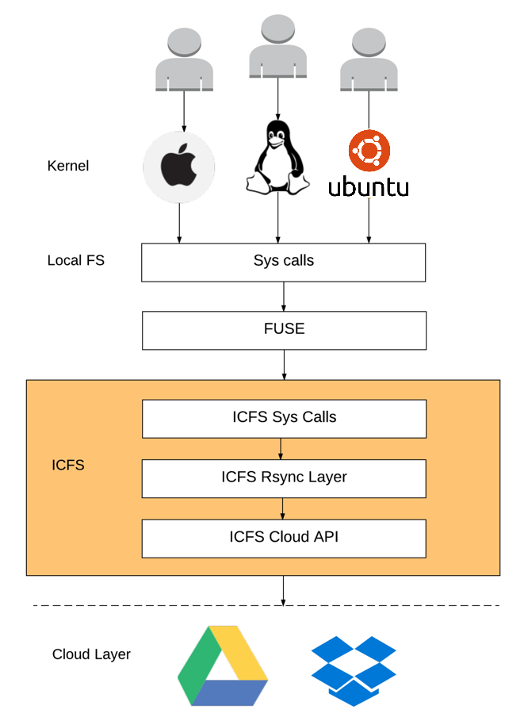

# ICFS (Integrated Cloud File System)

ICFS provides a unified interface for integrating multiple cloud services into one file system for combined storage. This requires splitting of files and distributing across multiple cloud accounts. Additionally, it also helps in uploading only the changed chunks preventing the need for re-uploading the whole file. With one step replication, data anonymity and reduced disk dependency, ICFS is a unique solution for present cloud scenario.

<!-- TOC -->

- [ICFS (Integrated Cloud File System)](#icfs-integrated-cloud-file-system)
    - [Setup](#setup)
    - [Introduction](#introduction)
    - [Novelty](#novelty)
    - [Design](#design)
        - [Assumptions](#assumptions)
        - [Cloud Storage Providers](#cloud-storage-providers)
        - [Data Structures](#data-structures)
        - [Disk Storage](#disk-storage)
        - [Fault Tolerance](#fault-tolerance)
    - [Implementation](#implementation)
        - [FUSE](#fuse)
        - [ICFS Sys Calls](#icfs-sys-calls)
            - [create](#create)
            - [open](#open)
            - [write](#write)
            - [rm](#rm)
            - [close](#close)
            - [mkdir](#mkdir)
        - [ICFS rsync](#icfs-rsync)
        - [ICFS Cloud API](#icfs-cloud-api)
    - [CLI](#cli)
    - [Known Bugs](#known-bugs)
    - [Future Work](#future-work)

<!-- /TOC -->

## Setup

- Create a virtual env with `Python 2.7`
- Go to the project root 
- To mount check [CLI](#cli)

## Introduction

With abundant cloud storage distributed across multiple providers it becomes difficult for a user to keep account of the files stored in each service. ICFS aims at reducing this hassle. Additionally, a user can now store a file size much greater than any cloud provider provides in a single account. Also with the future moving into cloud, a solution with a unified file system across different services which operates on minimal disk storage becomes highly important. This has been our major motivation behind this project.

## Novelty

The solution is novel in two main aspects. One, it allows anonymity of user data. Two, our solution does not rely on local disk storage as in the case of most cloud client systems.

## Design

In our initial approach we planned to rely on unix filesystem. We decided of using existing inodes/data blocks and distribute them across cloud. Soon we realised that even though we can leverage UNIX’s book-keeping, we still needed to maintain a meta data, which would define cloud relationships. This would have been an additional overhead while duplicating meta data. Finally, we made a tough decision of maintaining our own book-keeping(inodes), custom to our needs. This not only saved us the duplication of meta data but also enabled us to build a platform independent solution.

### Assumptions

1.  Minimum two cloud providers for 1-step replication.

2.  All cloud provider provide same amount of storage per account.

3.  Enough local disk space to download and proocess the file in use.

4.  Supported platforms Linux, BSD or Mac OS/X

### Cloud Storage Providers

The user can use multiple cloud providers to accumulate cloud space.The user has access to only 50% of the cloud space, because of one step replication. With more number of accounts added, this reduced space can be compensated. We decided to go with this trade off between data reliability and storage, as the former was of higher importance in our design. We are currently supporting Google Drive in our CloudAPI.

### Data Structures

The datastructure used is motivated from UNIX inode structure. The meta of a file is split into two datastructures, HeadChunk and ChunkMeta. The data is split into Chunks of constant size. HeadChunk and ChunkMeta correspond to inode of UNIX filesystem

1.  ***HeadChunk*** : Stores the meta-data for each file/directory uploaded. fields include

    1.  type : file or directory

    2.  size

    3.  created_time

    4.  modified_time

    5.  chunk_meta : Name of the corresponding ChunkMeta file.

    6.  accounts : The accounts where chunk meta should be fetched from.

2.  ***ChunkMeta*** : Stores information about the chunks such as

    1.  weak checksum: a weak 32-bit hash value for the chunk.

    2.  strong checksum: SHA-256, 256-bit (32-byte) hash value for the chunk.

    3.  chunk_name: Name of the chunk.

    4.  accounts : The accounts where the Chunk can be fetched from. An array of the fields mentioned above exists in a ChunkMeta file, each of which representing one chunk of the the whole file.

3.  ***Chunk*** : If the HeadChunk is of type-file, then the Chunk will store the actual data for the file. For a Directory, the Chunk will have

    1.  file_name : name of the file/directory.

    2.  head_chunk_name: name of the head_chunk for that file/directory.

    3.  accounts: accounts where the corresponding Chunk can be fetched.

### Disk Storage

In our current design, we are targeting to minimize the local disk dependency. We only store the HeadChunk for the root folder. Every other meta and data is fetched on demand and deleted as soon as the operation is complete.

### Fault Tolerance

We currently have a one step replication. All data is replicated across two services. If one service goes down, the user can still access/modify data on the second service. However, we are yet to handle the case when the service comes back again and bring back consistency. In an event where the number of services are less than two, our file system goes offline.

## Implementation

We created a unix inspired file system on merged cloud space. We used the FUSE to override the syscalls. Below are the basic file systems operations supported in ICFS. Below figure gives an overall picture of our system architecture.

### FUSE

Filesystem in Userspace (FUSE) is a software interface for Unix-like computer operating systems that lets non-privileged users create their own file systems without editing kernel code. This is achieved by running file system code in user space while the FUSE module provides only a “bridge” to the actual kernel interfaces. We used FUSE to override the system calls. Further we discuss the system calls we have implemented.

### ICFS Sys Calls

#### create

Creates a file with no chunks and returns an ICFS file descriptor.

1.  Fetch root information using locally stored root HeadChunk.

2.  Using root Chunk, linearly search and fetch the parent directory for the given path.

3.  Create HeadChunk and ChunkMeta for the new file using the above information.

4.  Add entry to the parent of the new file.

5.  Push new file (HeadChunk, MetaChunk) and parent(HeadChunk, MetaChunk,Chunk) to two random accounts in the cloud. Store the information of the accounts in the parent.

6.  Call open and return a ICFS file descriptor for the newly created file.

#### open

Opens the specified file and returns an ICFS file descriptor

1.  Fetch root information using locally stored root HeadChunk.

2.  Using root Chunk, linearly search and fetch the parent directory for the given path.

3.  Using the above information fetch the HeadChunk, ChunkMeta and Chunks of the file.

4.  Assemble the Chunks to save a temporary local file.

5.  Call python open on the local file to get python file object.

6.  Maintain ICFS file descriptor which maps to the python file object.

7.  Increase the number of links to the open file for ICFS.

8.  Return ICFS file descriptor.

#### write

Writes on to a given file and pushes it to the cloud.

1.  Using the ICFS file descriptor provided, look up the mapping to get python file object.

2.  Write on to the python file object.

3.  Push the written file.

#### rm

Deletes the specified file from the cloud taking into account the number of open instances of the file.

1.  Fetch root information using locally stored root HeadChunk.

2.  Using root Chunk, linearly search and fetch the parent directory for the given path.

3.  Using the above information fetch the HeadChunk, ChunkMeta and chunks of the file.

4.  Assemble the chunks of parent to save a temporary local file.

5.  Remove entry for the file from parent.

6.  Push parent to the cloud.

7.  Reduce the number of links to the file. If links is zero remove the file from cloud

#### close

During Close, the local copy of the file is deleted.

1.  Using the ICFS file descriptor find the corresponding python file object.

2.  Close the python file object.

3.  Reduce the links to the corresponding file

4.  if the number of links to the file is zero remove the assembled local file

#### mkdir

This is similar to File Create, but the data chunks will comprise of a folder structure. Also the HeadChunk will have flag marked to a Folder.

### ICFS rsync

We are using an open source implementation of the rsync algorithm [(source)](https://github.com/isislovecruft/pyrsync). We have adapted the existing implementation to our needs as following.

1.  Whenever a chunk is created, assign a weak and a strong checksum.

2.  Compare checksums of the newly created chunks to existing checksums in the cloud.

3.  Compute deltas consisting an array of indices representing the final chunks of the file. These indices may represent deletion/addition of chunks depending upon checksum comparisons.

4.  Push/remove Chunks based on the deltas.

### ICFS Cloud API

The cloud API provides four main interfaces and has been implemented for Google.

1.  Add account: This allows the user to authorize an account to be used by the filesystem.

2.  Push: Pushes a local file to specified account.

3.  Pull: Pulls a given file from the specified account.

4.  Remove: Removes specified file from the account.

5.  About: Gives information for a specified account.

## CLI

We have implemented a command line interface to enable ease of mount and access to ICFS. Currently we have 2 CLI targets.

1.  icfs mount $langle flags rangle$ $langle mount_location rangle$ : This mounts the specified folder under ICFS.

    1.  i - initalize with adding account.

    2.  a - define the no. of accounts to add. Default value for accounts is three.

    3.  d - delete all files from all registered cloud providers.

2.  icfs stat: Gives the total storage and free storage available in the cloud

[subsec:implementation]

## Known Bugs

1.  Although we have replicated data, in the event when a account is down, the data might not be fetched from the other account because of the stored meta data in the local system. Deleting the root meta file and rerunning would be a temporary fix but this has to be handled in the code. Note that this is a corner case in files stored directly in root as the the meta files other than root are always deleted.

2.  Concurrent access to file has not been handled. Different computers writing into the file and pushing might result in pushing chunks which when combined would give a corrupted file.

## Future Work

1.  Complete system calls by implementing rmdir, chmod, chown

2.  In the event when a service comes back after downtime consistency must be restored. This can be implemented by maintaining log files, which can be used to sync back the latest changes.

3.  We can extend the implementation to achieve de-duplication, which will improve the performance and save cloud space. To achieve de-duplication we can have a header to each chunk, storing the reference count for that Chunk. Thus if a chunk is duplicated, in multiple files, we can use the same chunk and have the ChunkMeta reference of each file stored in chunk header.

4.  We can implement a feature which allows sharing of files to other ICFS users. This can be done by making the HeadChunk, ChunkMeta and Data Chunks sharable and replacing all the chunk addresses in the HeadChunk and ChunkMeta with shareable links, after this the user simply shares the link of the HeadChunk to the other user.

5.  We can add encryption of files to ensure better privacy from services like Google, etc. We can do this on a file by file basis or by default. The ChunkMeta and Data Chunks will be encrypted by a random 256 bit AES Key. This Key will be stored in the HeadChunk which will be re-encrypted with the user’s password.

6.  The performance can be improved by maintaining cache tables and searching through them before accessing cloud. This also requires refreshing the cache in the event of file being changed in a different system.